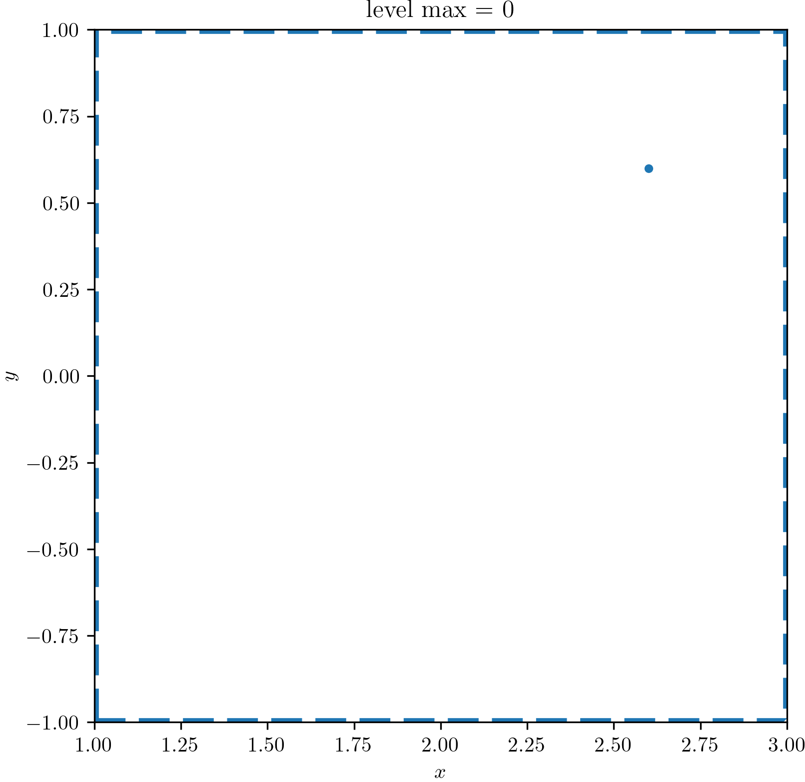
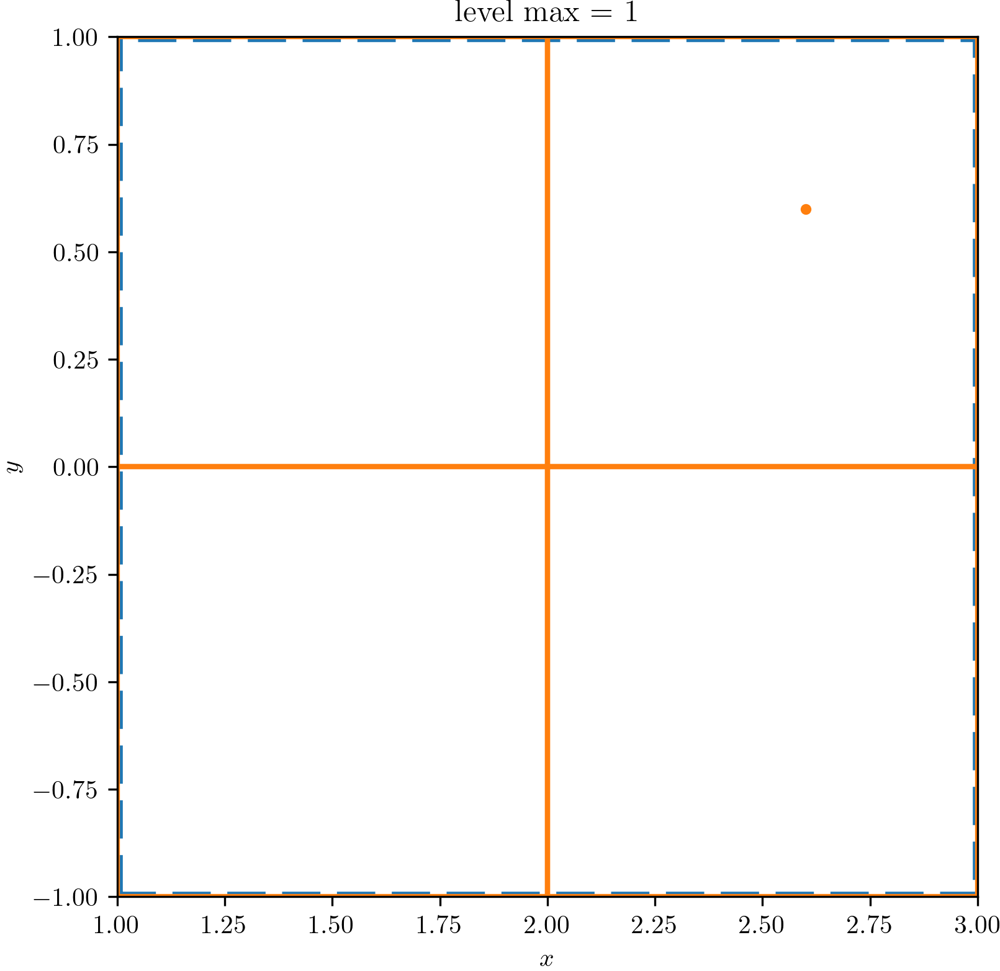
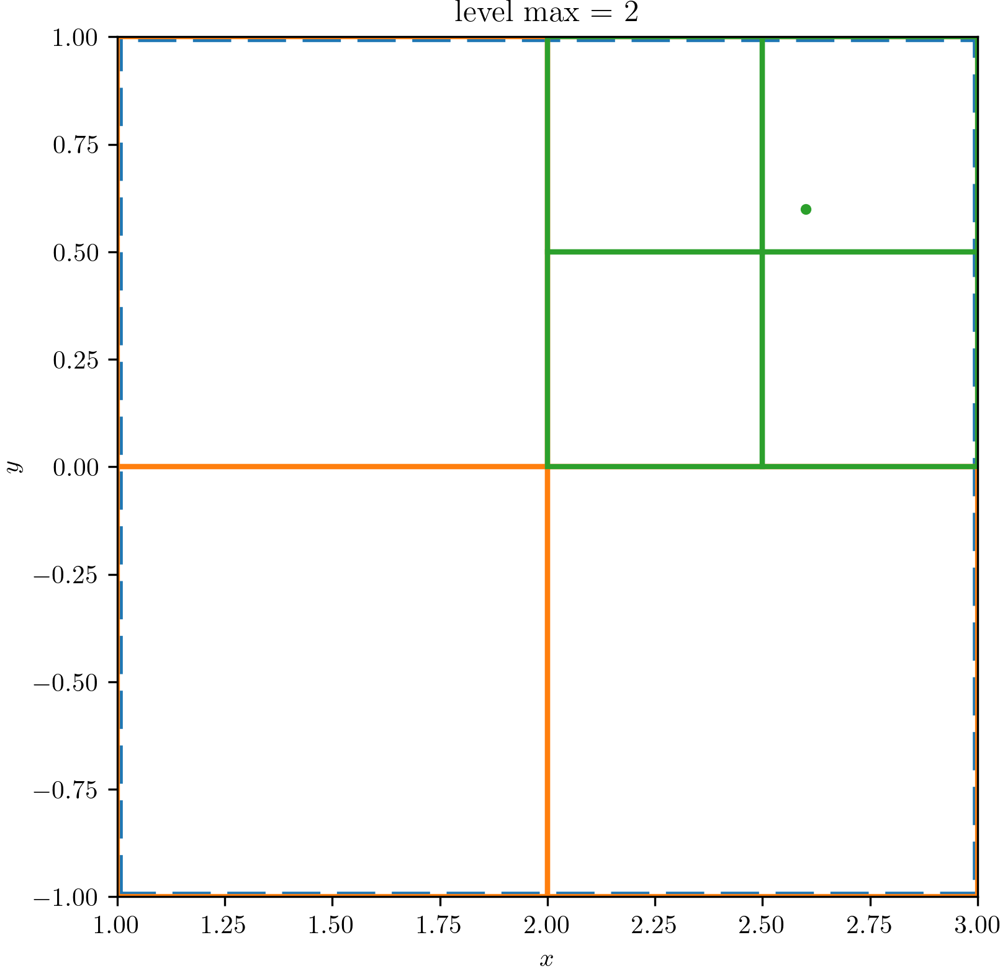
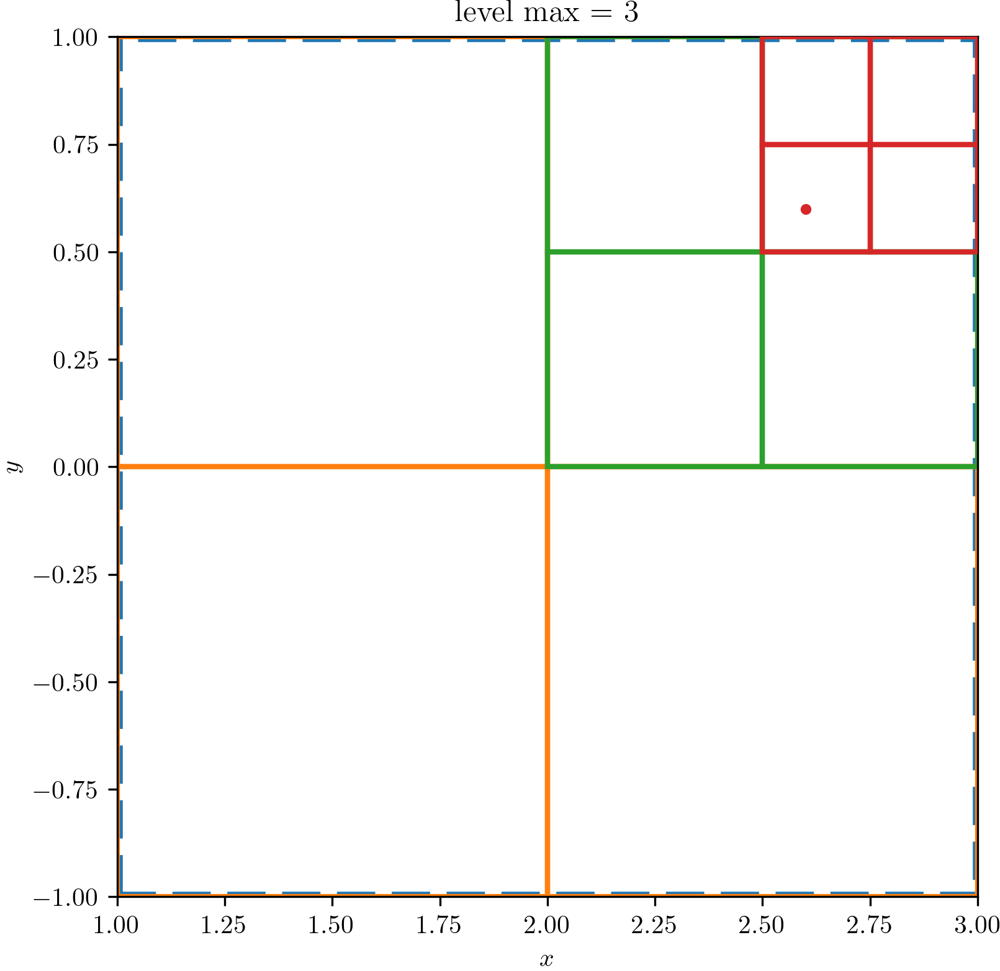
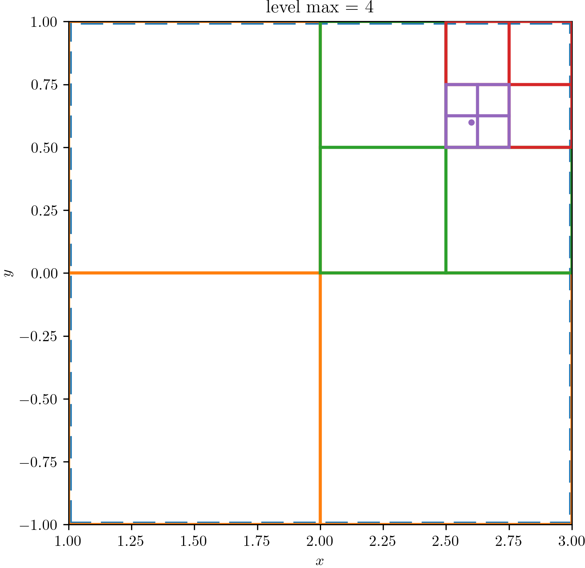
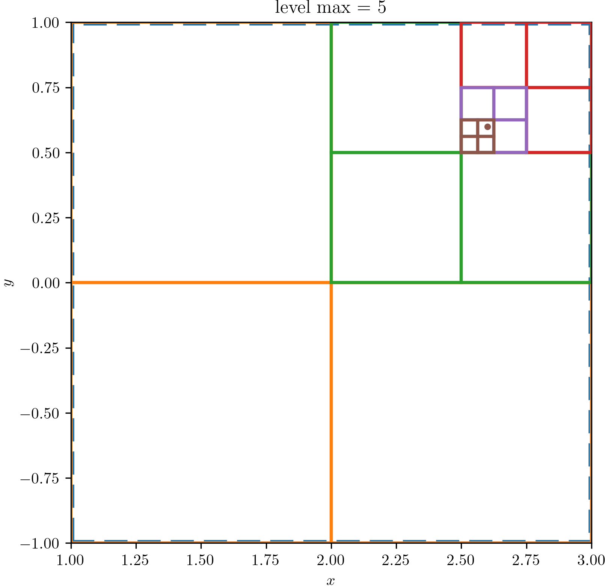
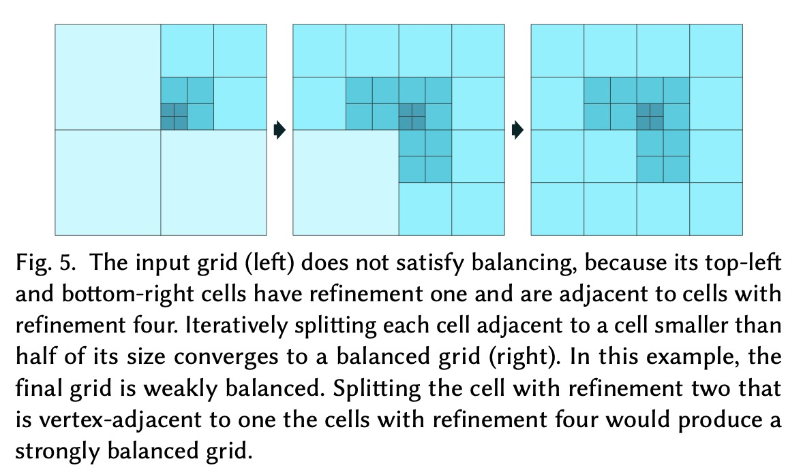
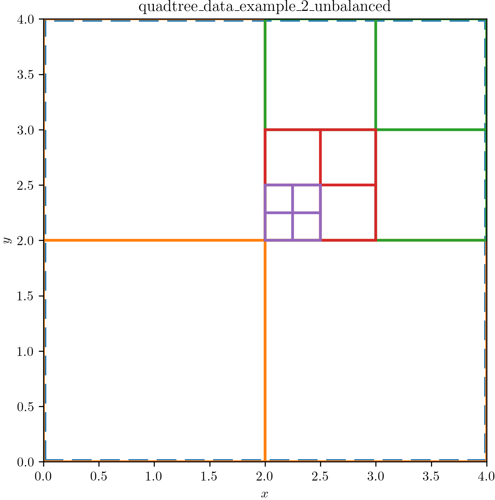
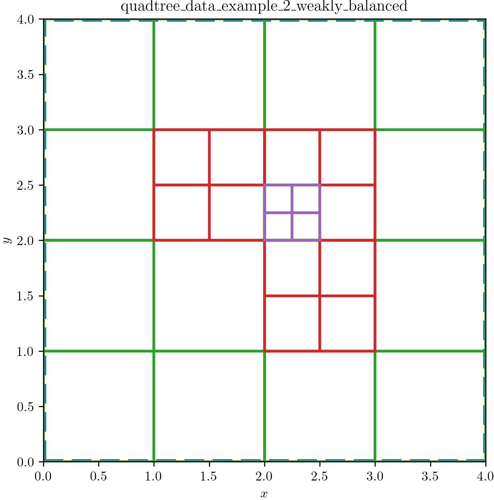

# Quadtree

This is a continuation of the historical documents:

* [quadtree](https://github.com/sandialabs/sibl/blob/master/geo/doc/quadtree.md)
* [primal/dual quadrilateral transitions](https://github.com/sandialabs/sibl/blob/master/geo/doc/dual_quad_transitions.md)

The current code:

* [src/lib.rs](src/lib.rs) create and write a quadtree
* [visualize_quadtree.py](visualize_quadtree.py) create *MATPLOTLIB* visualualization

## Example 1: Point-Stimulated Refinement

This example uses the `Quadtree` methods: `insert` and `refine`.

We construct a level zero (`L0`) square domain $(x, y) \in ([1, 3] \otimes  [-1, 1])$.
We then seed the quadtree with a single point at `(2.6, 0.6)`, which will be used to trigger refinement.  Finally, we set the maximum number of levels to `5`.  We show
successive levels of refinement `1..5`.  The following Rust code created this example:

```rust
// src/main.rs
// Create a L0 quadtree with a maximum of five refinement levels
let mut tree_1 = Quadtree::new(
    Rectangle {
        origin: Point { x: 1.0, y: -1.0 },
        width: 2.0,
        height: 2.0,
    },
    5,
);

// ne_ne_sw_sw_ne quadrant (up to level 5 refinement)
tree_1.insert(Point { x: 2.6, y: 0.6 });
tree_1.refine();
```

If the `refine` method encounters a leaf node with a point in it (`!points.is_empty()`)
and the maximum number of levels has not yet been reached (`self.levels < self.level_max`),
the the quadtree node subdivides (`self.subdivide()`).  Otherwise, the `refine` method encounters
a parent node, it subdivdes all of its children with recursive calls to `refine`.  The
full implementation appears below:

```rust
/// Refines the quadtree by subdividing leaves that contain points.
///
/// This function traverses the tree and subdivides any leaf node that
/// contains one or more points and has not yet reached `level_max`.
/// The process is recursive.
pub fn refine(&mut self) {
    // If the current node is a leaf that contains points and has not reached the
    // level_max, then subdivide it
    if let Node::Leaf { points } = &self.node {
        if !points.is_empty() && self.level < self.level_max {
            self.subdivide();
        }
    }
    // After potential subdivision, the node might now be a `Children` node.
    // If so, recursively refine each child.
    if let Node::Children { nw, ne, sw, se } = &mut self.node {
        nw.refine();
        ne.refine();
        sw.refine();
        se.refine();
    }
}
```

The `visualize` method of `Quadtree` serializes the quadtree to a YAML format.  Two examples
for `L0` and `L1` quadtrees are shown below:

[quadtree_data_L0.yaml](data/quadtree_data_L0.yaml)

```yml
boundary:
  origin:
    x: 1.0
    y: -1.0
  width: 2.0
  height: 2.0
level: 0
level_max: 0
node: !Leaf
  points:
  - x: 2.6
    y: 0.6
```

[quadtree_data_L1.yaml](data/quadtree_data_L1.yaml)

```yml
boundary:
  origin:
    x: 1.0
    y: -1.0
  width: 2.0
  height: 2.0
level: 0
level_max: 1
node: !Children
  nw:
    boundary:
      origin:
        x: 1.0
        y: 0.0
      width: 1.0
      height: 1.0
    level: 1
    level_max: 1
    node: !Leaf
      points: []
  ne:
    boundary:
      origin:
        x: 2.0
        y: 0.0
      width: 1.0
      height: 1.0
    level: 1
    level_max: 1
    node: !Leaf
      points:
      - x: 2.6
        y: 0.6
  sw:
    boundary:
      origin:
        x: 1.0
        y: -1.0
      width: 1.0
      height: 1.0
    level: 1
    level_max: 1
    node: !Leaf
      points: []
  se:
    boundary:
      origin:
        x: 2.0
        y: -1.0
      width: 1.0
      height: 1.0
    level: 1
    level_max: 1
    node: !Leaf
      points: []
```

The `visualize` method then calls Python with
[`visualize_quadtree.py`](./visualize_quadtree.py) to create *MATPLOTLIB* visualizations:

&nbsp; | &nbsp; | &nbsp;
:---: | :---: | :---:
 |  | 
 |  | 

## Balancing

The **balance constraint** is stated as,

* **Weakly balanced quadtree (2:1 balance)**
  * For a leaf cell `L` at level `l`, any edge-adjacent neighbor cell `N` at level `n` must satisfy `|l - n| ≤ 1`.
  * Equivalently, if `L` has level `l`, all edge-adjacent neighbors in the four cardinal directions (north, south, east, west) must have levels in the range `[l-1, l+1]`.
* **Strongly balanced quadtree**
  * For a leaf cell `L` at level `l`, any edge-adjacent OR corner-adjacent neighbor cell `N` at level `n` must satisfy `|l - n| ≤ 1`. This includes all eight directions: north, south, east, west, and the four diagonal directions (northeast, northwest, southeast, southwest).

**Boundary considerations**: At domain boundaries, a leaf may have a neighbor count fewer than 4 for weakly balanced (or 8 for strongly balanced). The constraints apply only to existing neighbors. This is typically understood but worth noting for implementation.

**"Leaf cell" specification**: The balance constraint applies only to a leaf node in the quadtree, not to internal nodes that have children.

## Example 2: 

This example uses the `Quadtree` method: `subdivide`, `weak_balance`, and `strong_balance`.
We recreate the **weakly balanced** quadtree example from [Pitzalis 2021](https://dl.acm.org/doi/pdf/10.1145/3478513.3480508), shown below:



### Example: Unbalanced Quadtree

Create the quadtree:

```rust
let mut tree_2 = Quadtree::new(
    Rectangle {
        origin: Point { x: 0.0, y: 0.0 },
        width: 4.0,
        height: 4.0,
    },
    4, // level_max
);
```

Manually `subdivide` the quadtree:

```rust
// subdivide four times to create an unbalanced quadtree
println!("Creating an unbalanced tree...");

tree_2.subdivide(); // L0 -> L1
// Get the NE child
let ne = match &mut tree_2.node {
    Node::Children { ne, .. } => ne,
    _ => panic!("L1 NE child should exist."),
};

ne.subdivide(); // L1 -> L2
// Get the NE_SW child
let ne_sw = match &mut ne.node {
    Node::Children { sw, .. } => sw,
    _ => panic!("L2 NE_SW child exist."),
};

ne_sw.subdivide(); // L2 -> L3
// Get the NE_SW_SW child
let ne_sw_sw = match &mut ne_sw.node {
    Node::Children { sw, .. } => sw,
    _ => panic!("L3 NW_SW_SW child should exist."),
};

ne_sw_sw.subdivide(); // L3 -> L4
```

The **unbalanced** (left) and **weakly balanced** (right) quadtrees are shown below:

unbalanced | weakly balanced
:---: | :---:
 | 

The weakly balanced currently has a bug:  The red `SW_NE` level 2 (green) should not be refined to level 3 (red).
It appears this last tree is actually *strongly* balanced by accident (for now).

### Example: Strongly Balanced Quadtree

To come.
